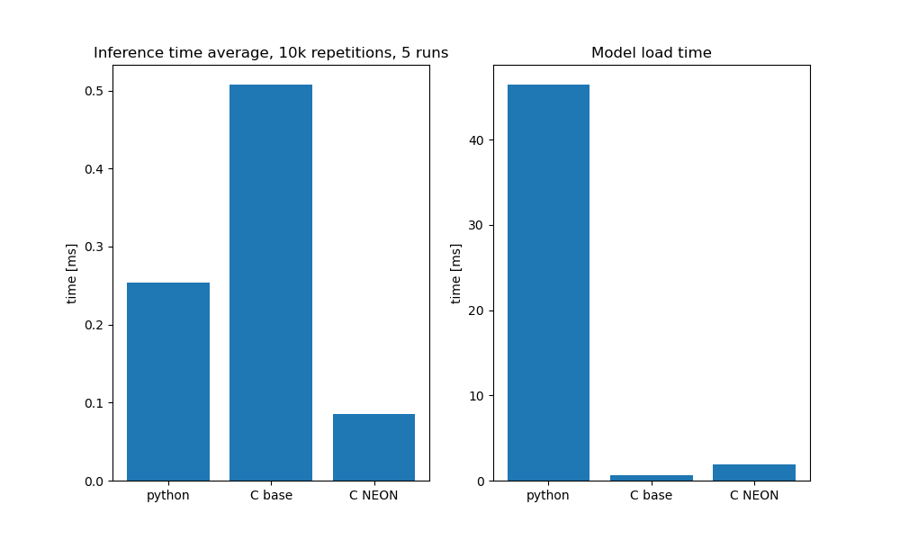

# MNIST Acceleration using Arm SIMD

This project consists of a feedforward neural network trained using PyTorch on the MNIST dataset,
combined with a C inference acceleration layer written using Arm64 NEON SIMD instructions and executed on a Raspberry Pi.

The primary objective is to learn more about both FNNs and PyTorch as well as SIMD, low level inference acceleration and CPU profiling.

## Training

The training was accomplished using PyTorch on the MNIST dataset.

After training, the PyTorch code holding the FNN in RAM exported the sufficient network's layers into a custom data format,
keeping the layer weights and biases easy to load in both Python and C.

For more details, see [the training directory README](training/README.md).

## Inference Implementation

The inference layer was implemented in 2 parts, firstly a Numpy reference implementation, then a C implementation with a variable matrix-vector multiplication kernel.

The C kernel, declared in an interface header `imatmul.h`, was implemented in 2 ways, firstly a simple, nested-for-loop universal C implementation,
and secondly using ACLE-provided NEON SIMD intrinsics, with an optimised memory pre-packing format included.

For more details, see [the inference directory README](inference/README.md).

## Performance Measurement Results

As is described in the inference directory README, performance measurement across Python and the 2 C implementations was achieved by capturing
current time before and after each network inference, and accumulated across multiple input images and repeats.
The bench mode of each program then reports an average (mean) time per inference in milliseconds, rounded to three significant figures.

The platform used for testing was a Raspberry Pi 5 with a headless installation of Raspberry Pi OS (Debian-based Linux, Arm64), accessed over SSH.
The performance test itself used 10,000 in-program repetitions over 5 program invocations, giving a total of 50,000 inferences.
In addition, each of the 5 invocations measured model load time, which was also averaged.

The results are enumerated in the following table:

| Statistic               | Python [ms] | C Base [ms] | C SIMD [ms] |
| ----------------------- | ----------: | ----------: | ----------: |
| Average inference time  |       0.254 |       0.508 |      0.0849 |
| Average model load time |        46.5 |       0.668 |        1.92 |

For a helpful visual reference, the following graphs generated using Python's MatPlotLib show the same figures:



It can be observed that the slowest implementation is the basic nested for loop C variant.
Even though the code itself was compiled with GCC's `-O2` optimization level (same as the SIMD variant), since the code doesn't contain any direct optimisations,
it runs the slowest, though with a still relatively fast about half a millisecond.

Even though the NumPy implementation is written in Python, it runs comparatively very fast thanks to NumPy's various optimisations.
As per the [official NumPy documentation](https://numpy.org/doc/stable/reference/simd/index.html), the library delegates its computationally heavy operations
to C code under the hood, making efficient use of multiplatform SIMD under the hood based on CPU architecture.

The increased execution time over the last implementation comes down most likely to Python orchestration and extra function call overhead,
as well as the code being more generally usable over the last implementation, which features code built specifically for this project's use case.

The fastest implementation by a large margin (nearly 3 times faster than the Python variant) is the specialised C SIMD version.
This comes down to the implementation, efficient use of memory, cache, CPU SIMD registers and instructions, described at a higher level in the inference directory README.

### SIMD Implementation Performance Impact

To start, it can be noted that unlike the base C implementation, this variant actually makes use of the provided `imatmul_kernel_pack` function, pre-packing weights
into memory at model load time, which also explains the slightly higher average model load time.

The purpose of said pre-packing is to introduce a memory layout allowing sequential access to weights at inference time, which is more cache-efficient.
Because of cache spacial locality, the assumption that data in close proximity is likely to be accessed at similar times, a call to load data from RAM fetches
an entire contiguous cache line, typically more values than directly necessary.
This means that when the program next loads data into registers, rather than from main memory, it can be loaded from CPU cache directly, which is a much lower-latency operation.

The kernel itself makes efficient use of specialised SIMD registers and instructions, offered by the CPU's advanced SIMD extension known as Arm Neon.
Using SIMD, the kernel loads a column segment each iteration, multiplies it by the corresponding input activation, and accumulates into output registers,
using the VMLA instruction (Vector Multiply Accumulate).
The output registers are initially populated with the weights, which eliminates the need for both register zero-initialisation and an additional vector add instruction after.

Mathematically, the specific approach to matrix-vector multiplication can be represented as

```math
\mathbf{o_k} = \mathbf{B_k} + \sum_{j=0}^{N} i_j \mathbf{W_kj}
```

given input buffer $\mathbf{i}$ with the j-th element $i_j$, output buffer $\mathbf{o}$ with a k-long segment $\mathbf{o_k}$,
the bias buffer $\mathbf{B}$ with a k-long segment $\mathbf{B_k}$, as well as $N$ the width of the weight matrix $\mathbf{W}$,
with $\mathbf{W_kj}$ representing a k-long column segment of the j-th column of $\mathbf{W}$.
Iterated in steps of $k$ over the weight matrix height, this computes the layer's full output buffer.

By taking a column segment at a time and iterating horizontally over the weight matrix in a larger row (height is the size of the column segment),
we can parallelise over each output activation, calculating multiple full outputs each outer loop iteration, and loading each weight only once.
This avoids the need for a final sum across all SIMD register elements, as well as requiring less memory writes, since we only write to each element of the output buffer once.

This does come with the drawback of needing to read the entire input buffer multiple times, however, this was deemed an insignificant cost in comparison to where the approach provides uplift.

Additionally, since Arm Neon provides up to 32 64-bit or 16 128-bit vector registers, for further parallelisation, to reduce loop iteration count and for better instruction-level parallelism,
each SIMD step in the main loop is unrolled to use 4 registers at a time (4 input and 4 output), each 128-bit holding 4 32-bit IEEE754 floats.
This allows us to process 16 weights at a time.

The ReLU activation function is optimised as well, reading over the output buffer in blocks of 16,
and implementing the rectified linear unit function using a VABS (Vector Absolute Value), VADD (Vector Addition) and VMUL (Vector-scalar Multiplication).
The implementation follows the formula

```math
\mathbf{b} = \frac{|\mathbf{a}| + \mathbf{a}}{2}
```

Given input vector (layer output buffer) $\mathbf{a}$ and final activated layer output vector $\mathbf{b}$.


